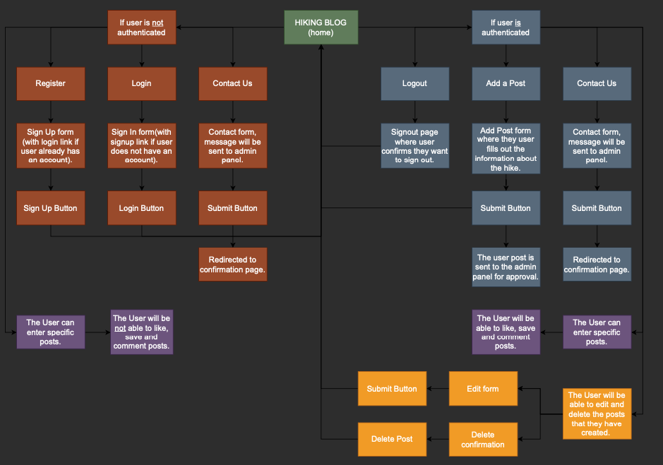

# The Hiking Blog - Project Portfolio 4

The Hiking Blog is a place where everyone from hiking enthusiasts to people curious about hiking can meet and share their experiences. Here they will be able to share hiking gems in their area and discover new favourite places.The users will be able to find hikes in their area and they will be able to adapt to their abilites through the difficulty level visible on the posts. 

&nbsp;

# User Experience (UX)

## **Site Aims**
---
- To provied the user with a website that allows them to view blog posts of hiking trails in their near surroundings and other places in Sweden.
- To make it easy for the user to find new hiking trails in their area and discover new places.
- To allow the user to create, read, update and delete posts.
- To provide the admin user with the ability to approve, update and delete blog posts.
- To provide a clear and appropriate response to any user inputs or actions.

## **Agile Methodology**
---
The Agile Methodology was used to plan this project. This was implemented through GitHub and the Project Board, it can be found here: [Hiking Blog Project](https://github.com/users/emeliehansson/projects/4).

## User Stories

### Iteration 1
- As a Site Admin I can create, read, update and delete posts, so that I can manage my blog content.
- As a Site Admin, I can approve or disapprove comments, so that I can filter out objectionable comments.

### Iteration 2
- As a User, I can find a collection of hiking trails and hidden gems in my area, so that I can discover new favourite places.
- As a user, I can click into the hiking path I find interesting, so that I can view the whole post on one page.
- As a user, I can save hiking trails, so that I can easily access the ones of interest to me.
- As a User, I can clearly understand the purpose of the website, so that I can see if the site is relevant for me.

### Iteration 3
- As a User, I can click to enter a blog post, so that I can view all the information on one page.
- As a User, I want to be able to read other users comments, so that I can take part of the conversation.
- As a User, I can register for an account, so that I can add my own blog posts with hiking trails in my area.
- As a User, I can create, update and delete my post, so that I can amend errors or add more information.
- As a User, I can find contact information on a separate page, so that I can contact the person responsible for the blog.
- As a User, I also want to know the difficulty level of the trail, so that I can adapt according to my abilities.

### User Stories for features to add in the future (backlog):
- As a User, I want to be able to look at a map with pinned hikes, so that I can more easily find hikes in my area.
- As a User, I want to be able to sort by category with the area I live in, so that I can more easily find hikes where I live. 
- As a User, I want to be able to create my own profile page, so that I can have my own page with my own posts and hikes that I have saved for the future.
- As a User, I can add my own image to my post, so that I can share a memory from when I visited the hike.

&nbsp;

Through the use of the Kanban board in the projects view in Github, the project was divided into a few different sections:

- Todo
- In Progress
- Done
- Backlog (future additions)

<details>
<summary>Layout of the Kanban board:</summary>
<br>


</details>

&nbsp;

## **Design Wireframes**
---

<details>
<summary>Mobile Wireframes</summary>
<br>


<br>


<br>


<br>


<br>


</details>

<details>
<summary>Tablet Wireframes</summary>
<br>


<br>


<br>


<br>


<br>


</details>

<details>
<summary>Desktop Wireframes</summary>
<br>


<br>


<br>


<br>


<br>


</details>

&nbsp;

## Flowchart

<details>
<summary>Flowchart</summary>
<br>


</details>

&nbsp;

## **Design Choices**
---

### Color Scheme

For the colorscheme of this project I used [Coolors](https://coolors.co/) to create a color palette based on the colors in the hero image. 
The white color I added as a softer background color and the red color is for the like-button.
The darkest color is for the text, the green color you can find in all the buttons(except for the delete-button, which is a darker color of the like-button) and in the footer. 
The beige color is found in the sign up, in and out forms. 


### Typography

The fonts chosen for this project is Montserrat together with Karla.

&nbsp;

# Features

## **Navigation**
---
- The navigation on the site has a few differences depending on if the user is logged in or not. The first image below is how it looks when the user is not logged in. They will be able to access the Sign up page, the Login page and the Contact page.
- In both views the name of the blogs also works as a link to the home page.
- The navbar is visible through all pages of the website.
&nbsp;


&nbsp;

- In the second view the logged in user will be able to access the Logout page, the page to Add Post as well as the Contact page. 
&nbsp;


## **Landing Page(home)**
---
- The Landing Page is the part of the website that is visible first when the site loads. It's purpose is to give the user a clear understanding if the page is relevant to them.
- The hero image is meant to catch the users attention and the hero image text to explain a little more further the purpose of the website.
&nbsp;


## **Sign Up Page**
---
- The Sign Up Page is accessed from the navbar.
- On this page there is also a link to the Sign In page incase the user clicked the wrong button by mistake, which will take them straight to the Sign In page instead.
- It uses django-allauth to provide all the settings for user authentication.
&nbsp;


## **Sign In Page**
---
- The Sign In Page is accessed from the navbar.
- On this page there is also a link to the Sign Up page incase the user clicked the wrong button by mistake, which will take them straight to the Sign Up page instead.
- It uses django-allauth to provide all the settings for user authentication.
&nbsp;


## **Sign Out Page**
---
- The Sign Out Page can only be accessed from the navbar when the user is logged in. 
- The Sign Out Page gets the user to confirm the really wish to log out by clicking another button.
- It uses django-allauth to provide all the settings for user authentication.
&nbsp;


## **Add Post Page**
---
- The Add Post button is only accessible from the navbar if the user is logged in. 
- The button brings the user to another page where they can fill out a form with the information they want to share.
- The post is then sent to the Admin Panel, where the admin can approve the post. Then it will show among the other posts on the home page.
&nbsp;


## **Detail Post Page**
---
- By clicking one of the posts the user will be redirected to a detail page for that specific post. 
- On this page they will be able to read the entire blog post.
&nbsp;


&nbsp;

- On this page the user will also be able to add comments to a specific post, as well as view comments from other users.
&nbsp;


## **Edit or Delete a Post**
---
- Only the user that created the post will be able to edit or delete a post. The Edit and Delete button will only be visible for the creator of the post.
&nbsp;


&nbsp;

- If the user chooses to edit the post they will be redirected to the edit page.
&nbsp;


&nbsp;

- If the user chooses to delete the post they will be redirected to another page where they will have to confirm they wish to delete the post.
&nbsp;


&nbsp;

## **Contact Page**
---
- The Contact Page is visible in the navbar both if the user is logged in or not. 
- When the user clicks the Contact button they will be redirected to a new page where they can fill out a form and send to the admin panel.
&nbsp;


&nbsp;

- When the user have submitted the message they will be redirected to a confirmation page.
&nbsp;


## **Footer**
---
- The Footer is a sticky footer visible from all pages on the site.
- The user can find links to LinkedIn, GitHub and Instagram.


&nbsp;

# Future Features

## **User Images**
---
- As a future part of the blog I would like to implement so that the users can add their own images to the posts through the Add Post page.
&nbsp;

## **Sorting by Area**
---
- I would also like to add a dropdown in the navbar with all the categories of the areas in Sweden. This way it would make it easier for the user to find hikes in their nearby area.
- Adding to this I would also like to have a map on the website where the user would be able to sort through the map as well.
&nbsp;

## **Profile Page**
---
- With a profile page the users would be able to view all of their own posts on their page. Here I would also like to implement the possibility for the user to save posts, where they will be able to view all their saved posts on their profile page.
&nbsp;

## **Search Bar**
---
- I would like to add a search bar to the navigation bar to make it easier for the user to search for the name of a specifik hike or area. This would also help to make sure that users does not add posts on the same hikes, since they would be able to search for the before adding a new post.

&nbsp;

# Technologies Used
- HTML - Used to structure all the templates on the site.
- CSS - to provide extra styling to the site.
- Python - To provide the functionality to the site. Packages used in the project can be found in requirements.txt.
- Django - Python framework used in the project.
- Heroku - Used to deploy the site publicly.
- Heroku ElephantSQL - Used for the database during development and deployment.
- Javascript - Minimum javascript was used to fade out alerts after a few seconds and to create a button that would bring the user back to the top of the screen.
- Bootstrap 4 - used for providing layouts and styling the html in the templates.
- Basimiq - Used to create wireframes for the project.
- Cloudinary - Used to host Static files for the site.

&nbsp;

# Testing

## **Validation**
--- 
### **CSS Validation**
The CSS Stylesheet was validated using [Jigsaw Validator](https://jigsaw.w3.org/css-validator/).
&nbsp;


&nbsp;

### **HTML Validation**
The HTML validation was done in [W3C Validator](https://validator.w3.org/). At the first validation the following error messages showed:
&nbsp;


&nbsp;

These errors were because I had the wrong code for my images in html templates, after changing it to style="width:100%; height:100%;" the validation went through without errors.
&nbsp;


&nbsp;

### **Python Validation**
All Python code has been validated through [Code Institutes Python Validator](https://pep8ci.herokuapp.com/).
&nbsp;

Only a few errors were found, for example "missing blank line at end of file" or "trailing whitespace". These were corrected and no other errors were found.
&nbsp;

### **JavaScript Validation**
All JavaScript code has been validated through [JSHint Validator](https://jshint.com/).  
&nbsp;

Only a few errors were found, for example "missing semicolon". These were corrected and no other errors were found.
&nbsp;


## **Lighthouse Testing**
---
### **Desktop**
At first Lighthouse testing for desktop, performance was measured at 43, and the main cause was that the images for the posts were too large. All of the other categories scored high.
&nbsp;


&nbsp;

After resizing the images for the blogposts and converting them to webp, the testing in Lighthouse was better.


&nbsp;

## **Manual Testing**
---
| Status| Navigation Bar - User Logged Out |
| ----- |-------------------------------|
|   ✓   | Clicking the navbar logo loads the home page|
|   ✓   | The navbar shows the Register, Login and Contact Us button if the user is logged out|
|   ✓   | Clicking the Register button in the navbar loads the sign up page|
|   ✓   | Clicking the Login button in the navbar loads the login page|
|   ✓   | Clicking the Contact button in the navbar loads the contact page|

&nbsp;

| Status| Navigation Bar - User Logged In |
| ----- |-------------------------------|
|   ✓   | Clicking the navbar logo loads the home page|
|   ✓   | The navbar show the Logout, Add Post and Contact us button if the user is logged in|
|   ✓   | Clicking the Logout button loads the confirmation page for logging out|
|   ✓   | Clicking the Add Post button loads the Add Post page with a form|
|   ✓   | Clicking the Contact button in the navbar loads the contact page|

&nbsp;

| Status| Footer - User Logged In & Out |
| ----- |-------------------------------|
|   ✓   | Clicking the LinkedIn button opens the LinkedIn page of the creator of this blog in a new tab|
|   ✓   | Clicking the GitHub button opens the GitHub page of the creator of this blog in a new tab|
|   ✓   | Clicking the Instagram button opens the Instagram login page in a new tab|

&nbsp;

| Status| Sign Up Page - User Logged Out |
| ----- |-------------------------------|
|   ✓   | Clicking the Register button in the navbar loads the sign up page|
|   ✓   | The username field is required|
|   ✓   | The email field is optional|
|   ✓   | The password field is required|
|   ✓   | The repeat password field is required|
|   ✓   | If you give a username and password too similar to eachother, user is asked to change one of them|
|   ✓   | If the password fields does not match eachother, user cannot sign up and feedback is provided|
|   ✓   | If the user provides a password that is less than eight characters, the user cannot sign up and feedback is provided|
|   ✓   | When sign up button is clicked, the user is signed up, logged in and redirected to the home page|
|   ✓   | An alert message shows that the user has been signed in successfully|

&nbsp;

| Status| Sign In Page - User Logged Out |
| ----- |-------------------------------|
|   ✓   | Clicking the Login button in the navbar loads the login page|
|   ✓   | The username field is required|
|   ✓   | The password field is required|
|   ✓   | If username and password does not match, user cannot log in and feedback is provided|
|   ✓   | If correct username and password are given, the user is logged in and redirected to the home page|
|   ✓   | The user recieves a message that they are logged in successfully|

&nbsp;

| Status| Logout Page - User Logged In|
| ----- |-------------------------------|
|   ✓   | Clicking the logout button in the navbar loads the confirmation page for logout|
|   ✓   | When the user confirms they wish to log out they are redirected to the home page|
|   ✓   | When the user is logged out, the navbar for not logged in users appear|

&nbsp;

| Status| Add Post Page - User Logged In|
| ----- |-------------------------------|
|   ✓   | Clicking the Add Post button in the navbar loads the add post page and a form|
|   ✓   | The Title field is required|
|   ✓   | The City field is required|
|   ✓   | The Category field is required, where the user can choose between all the different areas in Sweden|
|   ✓   | The Content field is required|
|   ✓   | The difficulty select menu is required|
|   ✓   | None of the fields accept just spaces in a field|
|   ✓   | None of the fields accept empty fields|
|   ✓   | The form cannot be submitted without all the required fields and user feedback is given if a user forgets a required field|
|   ✓   | Clicking the submit button redirects the user to the home page and an alert is shown that their post is awaiting approval|

&nbsp;

| Status| Edit Post Page - User Logged In|
| ----- |-------------------------------|
|   ✓   | The possibility to edit a post is only available to the creator of the post|
|   ✓   | The user can see the title of the post of the post they are editing|
|   ✓   | The user can see the city and areacategory of the post from the original|
|   ✓   | The content field is prepopulated with the old version of the post content|
|   ✓   | Clicking the submit button redirects the user to the home page and the user gets a message that the post has been updated|

&nbsp;

| Status| Delete Post Page - User Logged In|
| ----- |-------------------------------|
|   ✓   | The possibility to delete a post is only available to the creator of the post|
|   ✓   | The user will be asked if they are sure about deleting this post, with the name of the post visible on the page|
|   ✓   | Clicking the Delete post button deletes the post and redirects the user to the home page|

&nbsp;

| Status| Contact Page - User Logged In|
| ----- |-------------------------------|
|   ✓   | Clicking the contact button in the navbar loads the contact form on another page|
|   ✓   | The name field is required|
|   ✓   | The email field is required|
|   ✓   | The message field is required|
|   ✓   | Clicking the submit button redirects the user to a confirmation page|
|   ✓   | The messages are shown in the admin panel under 'contacts'|

&nbsp;


# Bugs and Errors During Development

### Problem: 
- Content was not showing behind the footer, it was not possible to scroll further down the page than shown in the image below:
&nbsp;


&nbsp;

### Solution:
- Added margin to the bottom of the body.
&nbsp;


&nbsp;

### Problem:
- The posts were not showing side by side as they should.
&nbsp;


&nbsp;

### Solution:
- Not 100% sure exactly what the problem was, I tried looking through the documentation for Bootstrap to see if I had made any mistakes with the cards, but couldn’t find anything. Neither could I find any errors in my CSS. The solution came when I decided to start over with the index.html, and redid the entire page. 
&nbsp;

### Problem:
- Submitting the posts made as a user on the page didn’t work.
&nbsp;


&nbsp;

### Solution:
- I had missed to make migrations after editing/adding a new variable, featured_image, to the AddPost class in models.py. I had also added the form parameter to the get_success_url method, which was not necessary. After these changes the form for add post was submitting as expected.
&nbsp;

### Problem:
- When I tried to add my EditPost view, template and url this error message showed.
&nbsp;


&nbsp;

### Solution:
- After some research and some help from the tutors, I found that the error was in my url path. I removed the post_id that I passed into the EditPost class and changed my path from `edit_post/<post_id>` to `edit_post/<pk>`. After these changes the EditPost function works as expected. 

# Deployment

The site was deployed using Heroku, following the steps offered by Codeinstitute.
You can find the instructions in a Google Docs [here](https://docs.google.com/document/d/1P5CWvS5cYalkQOLeQiijpSViDPogtKM7ZGyqK-yehhQ/edit#heading=h.5s9novsydyp1).

### 1. Creating the Django Project:

- Install Django and gunicorn: `pip3 install django gunicorn`
- Install supporting database libraries dj_database_url and psycopg2 library: `pip install dj_database_url psycopg2`
- Install Cloudinary libraries to manage static files: `pip install dj-3-cloudinary-storage`
- Create file for requirements: `pip freeze --local > requirements.txt`
- Create project: `django-admin startproject project_name`
- Create app: `python manage.py startapp app_name`
- Add app to list of `installed apps` in settings.py file: `'app_name'`
- Migrate changes: `python manage.py migrate`
- Test server works locally: `python manage.py runserver`

### 2. Create your Heroku App:

- Navigate to the Heroku website
- Create a Heroku account by entering your email address and a password (or login if you have one already).
- Activate the account through the authentication email sent to your email account
- Click the new button on the top right corner of the screen and select create a new app from the dropdown menu.
- Enter a unique name for the application.
- Select the appropriate region for the application.
- Click create app
- In the Heroku dashboard click on the Resources tab
- Scroll down to Add-Ons, search for and select 'Heroku Postgres'
- In the Settings tab, scroll down to 'Reveal Config Vars' and copy the text in the box beside DATABASE_URL.

### 3. Set up Environment Variables:

- In you IDE create a new env.py file in the top level directory
- Add env.py to the .gitignore file
- In env.py import the os library
- In env.py add `os.environ["DATABASE_URL"]` = "Paste in the text link copied above from Heroku DATABASE_URL"
- In env.py add `os.environ["SECRET_KEY"]` = "Make up your own random secret key"
- In Heroku Settings tab Config Vars enter the same secret key created in env.py by entering 'SECRET_KEY' in the box for 'KEY' and your randomly created secret key in the 'value' box.

### 4. Setting up settings.py
- In your Django 'settings.py' file type:

```
from pathlib import Path
import os
import dj_database_url

if os.path.isfile("env.py"):
    import env
```

- Remove the default insecure secret key in settings.py and replace with the link to the secret key variable in Heroku by typing: SECRET_KEY = os.environ.get(SECRET_KEY)
- Comment out the DATABASES section in settings.py and replace with:

```
DATABASES = {
  'default': 
  dj_database_url.parse(os.environ.get("DATABASE_URL"))
  }
```

- Create a Cloudinary account and from the 'Dashboard' in Cloudinary copy your url into the env.py file by typing: `os.environ["CLOUDINARY_URL"] = "cloudinary://<insert-your-url>"`
- In Heroku add cloudinary url to 'config vars'
- In Heroku config vars add DISABLE_COLLECTSTATIC with value of '1' (note: this must be removed for final deployment)
- Add Cloudinary libraries to the installed apps section of settings.py file:
```
'cloudinary_storage'
'django.contrib.staticfiles''
'cloudinary'
```

- Connect Cloudinary to the Django app in settings.py:

```
STATIC_URL = '/static'
STATICFILES_STORAGE = 'cloudinary_storage.storage.StaticHashedCloudinaryStorage'
STATICFILES_DIRS = [os.path.join(BASE_DIR, 'STATIC')]
STATIC_ROOT = os.path.join(BASE_DIR, 'staticfiles')
MEDIA_URL = '/media/'
DEFAULT_FILE_STORAGE =
'cloudinary_storage.storage.MediaCloudinaryStorage'
* Link file to the templates directory in Heroku 
* Place under the BASE_DIR: TEMPLATES_DIR = os.path.join(BASE_DIR,
'templates')
```

- Change the templates directory to TEMPLATES_DIR. Place within the TEMPLATES array: `'DIRS': [TEMPLATES_DIR]`
- Add Heroku Hostname to ALLOWED_HOSTS: `ALLOWED_HOSTS = ['rhi-book-nook.herokuapp.com', 'localhost']` *Create Procfile at the top level of the file structure and insert the following: web: gunicorn PROJECT_NAME.wsgi
- Make an initial commit and push the code to the GitHub Repository. `git add . git commit -m "Initial deployment" git push`

### 5. Heroku Deployment:
- Click Deploy tab in Heroku
- In the 'Deployment method' section select 'Github' and click the 'connect to Github' button to confirm.
- In the 'search' box enter the Github repository name for the project
- Click search and then click connect to link the heroku app with the Github repository. The box will confirm that heroku is connected to the repository.

### 6. Final Deployment
In the IDE:

- When development is complete change the debug setting to: DEBUG = False in settings.py
- In Heroku settings config vars change the DISABLE_COLLECTSTATIC value to 0
- Because DEBUG must be switched to True for development and False for production it is recommended that only manual deployment is used in Heroku.
- To manually deploy click the button 'Deploy Branch'. The default 'main' option in the dropdown menu should be selected in both cases. When the app is deployed a message 'Your app was successfully deployed' will be shown. Click 'view' to see the deployed app in the browser.

&nbsp;

## **Local Development**
---

### How to Fork
- To fork my repository:

    - Login (or sign up) to GitHub.
    - Go to the repository for this project here
    - Click the Fork button in the top right corner.

### How to Clone
- If you wish to clone my project, please see the following steps below:

    - Navigate to GitHub: https://github.com/emeliehansson/hiking-trail-blog-milestone4 
    - Select the 'Clone' button Copy the URL or download it as a ZIP file Use git clone + the URL in your terminal, or unpack the ZIP containing the project.

&nbsp;

# Credits

## **Design**
- [Pexels](https://www.pexels.com/sv-se/)
- [PicJumbo](https://picjumbo.com/)
- [Coolors](https://coolors.co/)
- [Favicon](https://www.flaticon.com/search?word=hiking%20boots)
- [TinyPNG](https://tinypng.com/)
- [Convertio](https://convertio.co/jpg-webp/)
- [Diagrams.net](https://www.diagrams.net/) was used to create the flowchart.
- [Balsamiq](https://balsamiq.com/) was used to create the wireframes.

## **Code**
- [Bootstrap code for hero image](https://gist.github.com/adamdehaven/dceabb07450295fec6fc)
- Code Institute Codestar project: borrowed code for some of the html templates.
- Code Institute: I think therefore I blog module. Helped me with starting up my project by following the instructions.
- [Cheatsheet for creating README.md](https://github.com/adam-p/markdown-here/wiki/Markdown-Cheatsheet#tables)